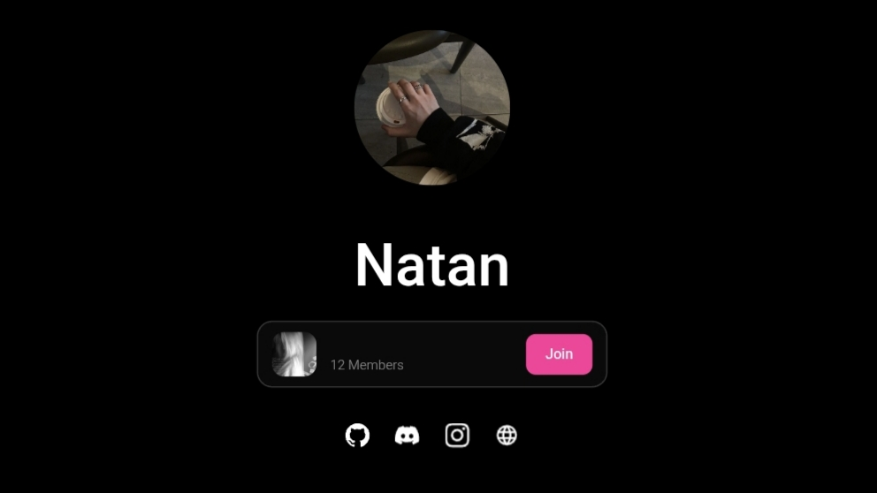

# Natan — Personal Website

A static personal bio-link page. Profile picture and display name are
pulled automatically from a Discord account, plus a Discord server card
and a set of social links. Built with plain HTML, CSS, and JavaScript —
no build tools, no framework.

<p align="center">
  
</p>

## Features

- Profile picture and display name fetched automatically from Discord in
  real time via the [Lanyard API](https://github.com/Phineas/lanyard) (no
  manual updates needed).
- Discord server card showing the server icon, name, member count, and a
  Join button linking to your server invite.
- Automatic dark/light mode based on system preference, saved in
  `localStorage` to avoid flashing on reload.
- Skeleton loading for avatar, name, and server card while data is being
  fetched, with a smooth fade-in once ready.
- Click sound effect.
- Static avatar fallback if the Discord API is unreachable.
- Responsive layout for both mobile and desktop.

## Folder structure

```
Natan/
├── index.html      # Page structure (HTML)
├── style.css        # Styling and color theme
├── script.js         # Logic: fetch Discord data, render avatar/server card, etc.
├── img/
│   ├── Natan.jpg     # Static fallback profile picture
│   ├── preview.jpg    # Preview screenshot for the README
│   └── favicon.ico
└── audio/
    └── click.ogg     # Click sound effect
```

## Configuration

All the main settings live near the top of **`script.js`** (`CONFIG` and
`PERSON_INFO`). You shouldn't need to touch anything else just to change
your data.

### 1. Discord account data

```js
const PERSON_INFO = {
  discordId: "YOUR_DISCORD_USER_ID",
  discordServerId: "YOUR_DISCORD_SERVER_ID",
  discordInviteCode: "YOUR_INVITE_CODE", // the part after discord.gg/
};
```

How to get the IDs and invite code:
1. In Discord, go to **Settings → Advanced** and enable **Developer Mode**.
2. Right-click your profile picture and select **Copy User ID**, then set
   it as `discordId`. This ID is also used for the Discord icon link in
   the social links section (`https://discord.com/users/YOUR_ID`).
3. Right-click your server icon and select **Copy Server ID**, then set
   it as `discordServerId`.
4. In any channel, click **Invite People** (or right-click the channel →
   Invite People), create or pick a **permanent invite** (Never Expire,
   Unlimited Uses), and copy the code after `discord.gg/` into
   `discordInviteCode`.

Note: the invite code must be permanent. If it expires or is limited, the
server card will show an error message instead of your server data.

For the server card, profile picture, and name to show up, your Discord
account needs to be registered with
[Lanyard](https://github.com/Phineas/lanyard) — just join the
[Lanyard Discord server](https://discord.gg/lanyard) once, no message
required.

### 2. Avatar settings

```js
const CONFIG = {
  useDiscordAvatar: true,     // false = use the static image at img/Natan.jpg
  decorationInFront: true,    // position of the Discord avatar decoration, if any
  showStatus: false,          // show the online/idle/dnd status dot
  avatarSize: 190,            // avatar size on desktop (px)
  mobileAvatarSize: 150,      // avatar size on mobile (px)
};
```

### 3. Social links

Edit these directly in **`index.html`**, in the `<!-- Social links -->`
section. Just change the `href` value on each `<a>` tag (current order:
GitHub, Discord, Instagram, Portfolio):

```html
<a href="https://github.com/YOUR_USERNAME" ...>
<a href="https://discord.com/users/YOUR_DISCORD_USER_ID" ...>
<a href="https://instagram.com/YOUR_USERNAME" ...>
<a href="https://your-portfolio-link.com" ...>
```

The Discord icon opens your Discord profile when clicked (via
`discord.com/users/<id>`) — it opens the Discord app if installed, or the
web version otherwise.

### 4. Title and meta tags (SEO / link preview)

To change the browser tab title or the preview shown when the link is
shared (on Discord, Twitter, WhatsApp, etc.), edit the `<head>` section
in **`index.html`**: `<title>`, `og:title`, `og:description`,
`twitter:title`, and `twitter:description`.

## Running locally

Since this page makes `fetch()` calls to external APIs, open it through a
local server (not `file://`) to avoid CORS issues in some browsers:

```bash
# from inside the Natan/ folder
python3 -m http.server 7700
# then open http://localhost:7700 in your browser
```

Or use the Live Server extension in VS Code.

## Deploying to GitHub Pages

1. Create a new GitHub repository and upload the contents of the `Natan/`
   folder (not the folder itself — `index.html` needs to be at the repo
   root).
2. Open **Settings → Pages** in that repository.
3. Under **Source**, select the `main` branch and the `/ (root)` folder.
4. Save — the site will be live at
   `https://USERNAME.github.io/REPO_NAME/` after a few minutes.

If you want a custom domain, add a `CNAME` file with your domain at the
repo root and configure DNS as described in the
[GitHub Pages documentation](https://docs.github.com/pages).

## Tech stack

- Plain HTML5 and CSS3 (no framework)
- Vanilla JavaScript (no dependencies, no build step)
- [Lanyard API](https://github.com/Phineas/lanyard) — Discord presence data
- [Discord API](https://discord.com/developers/docs/intro) — server invite data

## License

Free to use and modify for personal purposes.
